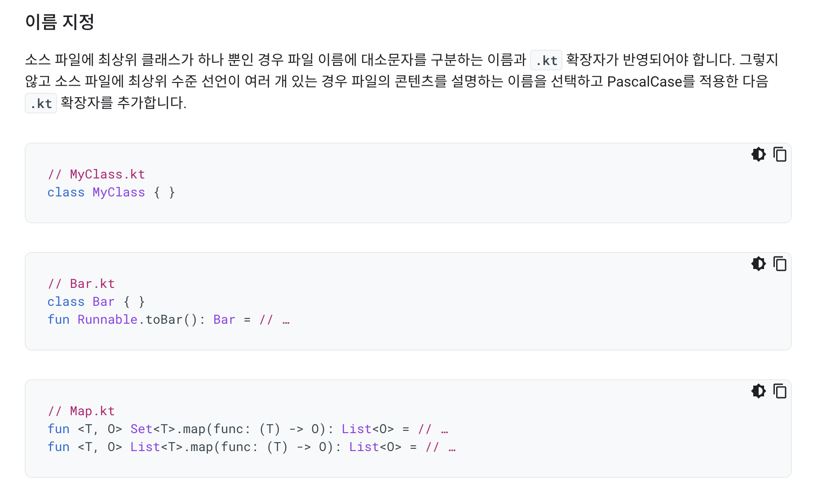
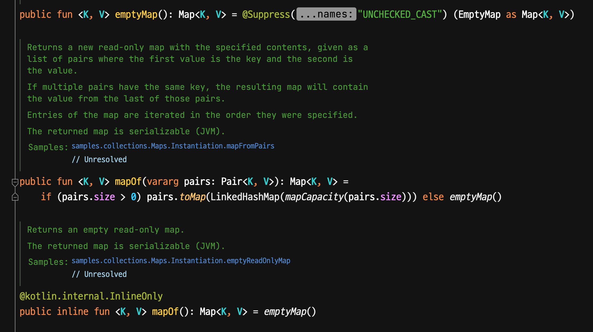
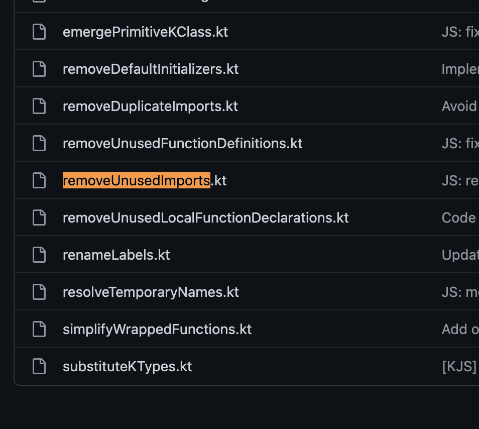

# (Kotlin) 단일 함수만 존재하는 경우 파일명은 어떻게 해야할까?

NextStep의 [이펙티브 코틀린 with TDD, Refactoring, Clean Code](https://edu.nextstep.camp/c/Z9QeJlCi/) 을 수강중이다.  

> 내가 작성한 코드에 대해 이렇게 많이 리뷰 받는게 오랫만이다

이번에 받은 리뷰중에서는 납득이 잘 안되는게 있어서 리뷰어이신 재성님(Jason) 과 이런저런 토론을 진행했었다.  

## 논의

논의 대상인 코드는 public 함수 하나(`main`)만 존재하기 때문에 파일명을 `main.kt`로 만들었다.  
  
이에 대해 재성님은 소스 파일은 전부 PascalCase를 쓰는게 좋다는 의견이셨다.

이에 대한 이유는 [Kotlin Convention](https://kotlinlang.org/docs/coding-conventions.html#source-file-names) 에서 UpperCamelCase (PascalCase) 을 추천하기 때문이였다.

[안드로이드 코틀린 공식 가이드](https://developer.android.com/kotlin/style-guide?hl=ko#naming)에서도 소스 파일에 대해서는 PascalCase를 언급하기도 한다.

반면 내 생각은 기본적으로는 PascalCase 를 가져가더라도 **public 함수 1개만 존재하는 경우** (private 함수는 몇개가 있어도 관계 없이) 오히려 그 함수를 나타내는 파일명이 더 좋다 라는 것이다.

> 실제로 지금 JS/TS 프로젝트에서 그렇게 하고 있고 좋다고 느꼈다.

재성님과 이야기 나누면서 서로 먼저 전제한 부분은 다음과 같다

* 꼭 클래스나 함수명에 맞춰서 파일명을 지을 필요는 없다.
  * 여러 클래스, 함수가 복합적으로 있는 파일도 있기 때문이다.
  * ex) `Maps` 등
* 해당 파일의 코드들이 **무엇을 다루는가에 따라 이름을 지어야 한다**

이와 같은 전제하에 재성님은 `function`이 있더라도 파일명은 PascalCase로 들어야 하는 예시로 코틀린 표준 라이브러리인 `Maps` 를 언급해주셨다.

Maps는 `function` 들이 있지만 결국 PascalCase로 된 파일이였다.  
이유는 Maps 에서는 여러 `function`들이 존재하지만, 결국 이 파일의 목적은 **Maps에 관한 여러 지원**을 담당하고, 표준 컨벤션에 맞춰 PascalCase를 선택한것으로 보였다.  
  
나 역시 이부분에 대해서는 PasclCase가 적합하다고 생각했다.  
  
다만, 내가 생각한 기준인 **public 함수 1개만 존재하는 경우**에 대한 예시로는 적절하지 않다고 생각했다.  

비슷한 고민이 reddit에도 있었지만, 원하던 질문과 답변은 아니였다.

* [Kotlin File Naming Conventions?](https://www.reddit.com/r/Kotlin/comments/72ialu/file_naming_conventions)

그래서 서로 이에 대한 사례들을 [Kotlin stdlib](https://github.com/JetBrains/kotlin/tree/6a670dc5f38fc73eb01d754d8f7c158ae0176ceb/libraries/stdlib)에서 찾아보았다.  
  
찾아보니 코틀린 표준 라이브러리에서도 **public 함수가 1개만 존재하는 경우**가 몇가지 있었고, **이들은 모두 함수명과 동일하게 CamelCase**를 파일명으로 사용했다.  

**compareTo**

([Github](https://github.com/JetBrains/kotlin/blob/6a670dc5f38fc73eb01d754d8f7c158ae0176ceb/libraries/stdlib/src/kotlin/comparisons/compareTo.kt))  
  
**removeUnusedImports**

([Github](https://github.com/JetBrains/kotlin/blob/92d200e093c693b3c06e53a39e0b0973b84c7ec5/js/js.inliner/src/org/jetbrains/kotlin/js/inline/clean/removeUnusedImports.kt))  

특히 **removeUnusedImports**는 명확하게 **1개의 public 함수와 private 함수 여러개**가 있던 파일이였다.

코틀린 표준 라이브러리에서도 **public 함수가 1개만 존재하는 경우**에서는 CamelCase를 사용하는것을 확인하게 되어서 논의는 쉽게 마무리 될 수 있었다.

## 결론

코틀린에서는 다음과 같이 파일명 규칙을 가져가는게 좋겠다는 생각을 했다.

* public interface (`class`, `function` 등) 들이 **여러개**가 존재하는 경우
  * PascalCase (`Maps.kt`, `Numbers.kt` 등)
* public interface (`class`, `function` 등) 들이 **1개만** 존재하는 경우
  * 해당 interface의 이름과 같은 컨벤션
    * `class`: `ClassName.kt`
    * `function`: `funName.kt`

### 번외

JS/TS 에서는 **여러 function들이 모여있는 경우** 파일명을 어떻게 하고 있을까?  
  
대표적인 몇가지 라이브러리를 대상으로 찾아보았다.  
  
#### Jest

**print**

**spyMatchers**

#### Nest.js

**on-app-bootstrap.hook.ts**

**messages.ts**

JS/TS에서는 JVM과는 반대로 **PascalCase가 예외적인 상황**에서 사용되며, 대부분의 경우 camelCase 혹은 kebab-case를 기본적으로 가져갔다.

